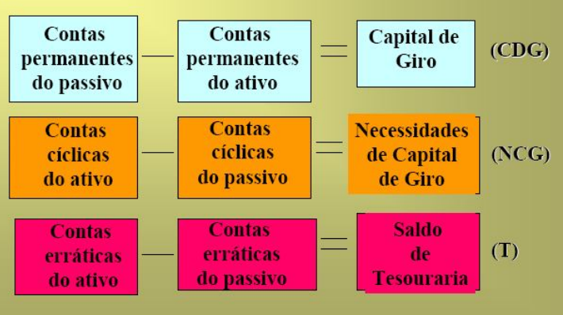
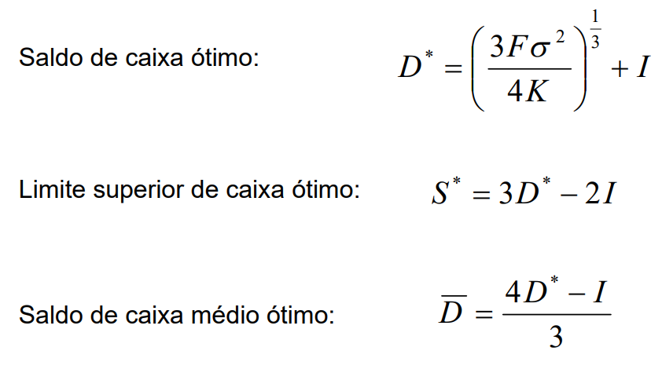
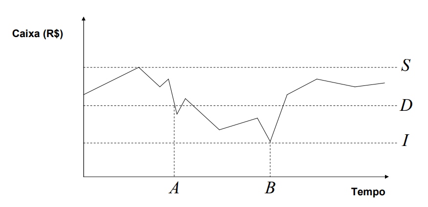

# Análises de Estrutura de Capital da Empresa

## FUNCIONALIDADES

### 1. Cálculo e Monitoramento do Termômetro de Liquidez (TL):
- Cálculo das variáveis do Modelo Dinâmico: Capital de Giro (CDG), Necessidade de Capital de Giro (NCG) e Saldo de Tesouraria (T) a partir de dados de balanço (passivo e ativo permanentes/cíclicos/erráticos).

- Cálculo do Termômetro de Liquidez ($TL$) usando a fórmula: $TL=\frac{T}{|NCG|}$ 16, onde $T$ é o Saldo de Tesouraria e $NCG$ é a Necessidade de Capital de Giro.

  

#### Informações necessárias:

- Passivo permanente
- Ativo permanente
- Ativo Cíclico
- Passivo Cíclico
- Ativo Errático 
- Passivo Errático 

### 2. Cálculo dos Limites/Necessidades de Caixa Ótimos:
- inputs:  custos fixos de transação ($F$), a variância dos fluxos de caixa ($\sigma^2$), o custo de oportunidade ($K$) e o limite inferior definido ($I$)
- Cálculo do saldo de caixa ótimo ($D^*$), o limite superior de caixa ótimo ($S^*$) e Saldo de caixa médio ótimo ($\overline{D}$) usando o Modelo Miller-Orr

  

### 3. Impressão do Fluxo De Caixa com limites inferior e superior
- inputs: D (saldo de caixa apropriado), I (limite inferior do saldo de caixa, definido pela gestão) e S (limite superior calculado pelo modelo)
- Utiliza valores históricos para apresentar a variação ao longo do tempo, baseado no modelo abaixo

  

### 4. Impressão da Estrutura de Capital da Empresa
- Informações necessárias: 
    - Investimento Operacional em Giro
    - Investimento em Ativos Fixos
    - Dívida Líquida a Curto Prazo
    - Dívida a Longo Prazo
    - Capital Próprio
- Objetivo: Permitir uma visualização das informações para análise do usuário, inspirado pela representação abaixo.

  

## REFERÊNCIAS
- [Slides do capítulo 15](./AUXILIARES/Cap_15.pdf) disponibilizados no moodle pelo prof. Bruno Perez.
- BERK, J. DEMARZO, P. HARFORD, J. Fundamentos de finanças empresariais. Porto Alegre: Bookman, 2010.