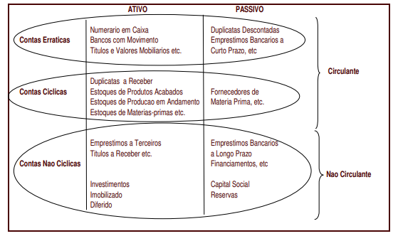
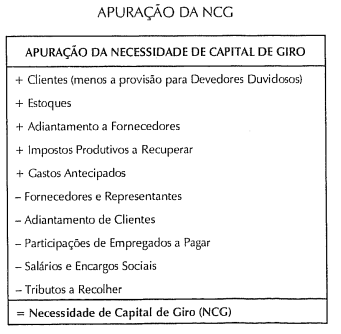
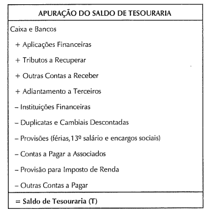

# Análises de Estrutura de Capital da Empresa
Trabalho Prático da disciplina Admiistração Financeira (CAD167) em 2025/2 na UFMG

**Enunciado base**: Esse trabalho deve ser realizado em duplas e consiste no desenvolvimento de uma aplicação relacionada a um dos temas tratados na segunda metade do curso de Administração Financeira ministrado na turma de Sistemas de Informação.

**Mais informações**: [Enunciado.pdf](./AUXILIARES/Enunciado.pdf)

## CONTEÚDO
1. [Membros da Equipe](#membros-do-grupo)
2. [Funcionalidades](#funcionalidades)
    - [Cálculo e Monitoramento do Termômetro de Liquidez](#1-cálculo-e-monitoramento-do-termômetro-de-liquidez-tl)
    - [Cálculo dos Limites/Necessidades de Caixa Ótimos](#2-cálculo-dos-limitesnecessidades-de-caixa-ótimos)
    - [Impressão do Fluxo De Caixa com limites inferior e superior](#3-impressão-do-fluxo-de-caixa-com-limites-inferior-e-superior)
    - [Impressão da Estrutura de Capital da Empresa](#4-impressão-da-estrutura-de-capital-da-empresa)

3. [Conceitos Utilizados](#explicação-do-sistema)
4. [Referências](#referências)

## Membros do grupo:
1) Carla Beatriz Ferreira
2) Vítor Terra Mattos do Pratrocínio Veloso

## FUNCIONALIDADES

### 1. Cálculo e Monitoramento do Termômetro de Liquidez (TL):
- Cálculo das variáveis do Modelo Dinâmico: Capital de Giro (CDG), Necessidade de Capital de Giro (NCG) e Saldo de Tesouraria (T) a partir de dados de balanço (passivo e ativo permanentes/cíclicos/erráticos).

- Cálculo do Termômetro de Liquidez ($TL$) usando a fórmula: $TL=\frac{T}{|NCG|}$ 16, onde $T$ é o Saldo de Tesouraria e $NCG$ é a Necessidade de Capital de Giro.

  

#### Informações necessárias:

- Passivo permanente
- Ativo permanente
- Ativo Cíclico
- Passivo Cíclico
- Ativo Errático 
- Passivo Errático 

### 2. Cálculo dos Limites/Necessidades de Caixa Ótimos:
- inputs:  custos fixos de transação ($F$), a variância dos fluxos de caixa ($\sigma^2$), o custo de oportunidade ($K$) e o limite inferior definido ($I$)
- Cálculo do saldo de caixa ótimo ($D^\*$), o limite superior de caixa ótimo ($S^\*$) e Saldo de caixa médio ótimo ($\overline{D}$) usando o Modelo Miller-Orr

  

### 3. Impressão do Fluxo De Caixa com limites inferior e superior
- inputs: D (saldo de caixa apropriado), I (limite inferior do saldo de caixa, definido pela gestão) e S (limite superior calculado pelo modelo)
- Utiliza valores históricos para apresentar a variação ao longo do tempo, baseado no modelo abaixo

  

### 4. Impressão da Estrutura de Capital da Empresa
- Informações necessárias: 
    - Investimento Operacional em Giro
    - Investimento em Ativos Fixos
    - Dívida Líquida a Curto Prazo
    - Dívida a Longo Prazo
    - Capital Próprio
- Objetivo: Permitir uma visualização das informações para análise do usuário, inspirado pela representação abaixo.

  

## CONCEITOS UTILIZADOS
Esta seção apresenta um breve resumo dos conceitos utilizados para realização da implementação apresentada.

1. Contas permanentes, cíclicas e erráticas

    "As contas permanentes são contas do balanço patrimonial que não são encerradas ao final de um período contábil. Os saldos dessas contas não são zerados ao final de cada período contábil, mas sim transferidos continuamente para os períodos contábeis subsequentes.
    Também conhecidas como contas reais ou do razão geral, as contas permanentes são registradas pelos contadores ao final do período contábil. "

    "As  contas  operacionais  ou  cíclicas  estão  assim  denominadas  devido  a  sua  relação  ao  ciclo  operacional  das  empresas,  e  estão  diretamente relacionadas  com  as  atividades  primarias  da  organização,  e  representam  os bens direitos e obrigações da empresa que são necessários para a manutenção das margens de retorno esperadas"

  

  

  

- Fonte das imagens: 
    - [Modelo Dinâmico de Capital de Giro - PUC RIO](./AUXILIARES/13057_4.PDF)
    - [O modelo dinâmico de gestão financeira de empresas: Procedimentos de Operacionalização - Antônio D. Pereira Filho](./AUXILIARES/bcavelino,+2+-+O+modelo+dinâmico+de+gestão+financeira+de+empresas.pdf) 

## REFERÊNCIAS
- [Slides do capítulo 15](./AUXILIARES/Cap_15.pdf) disponibilizados no moodle pelo prof. Bruno Perez.
- BERK, J. DEMARZO, P. HARFORD, J. Fundamentos de finanças empresariais. Porto Alegre: Bookman, 2010.
